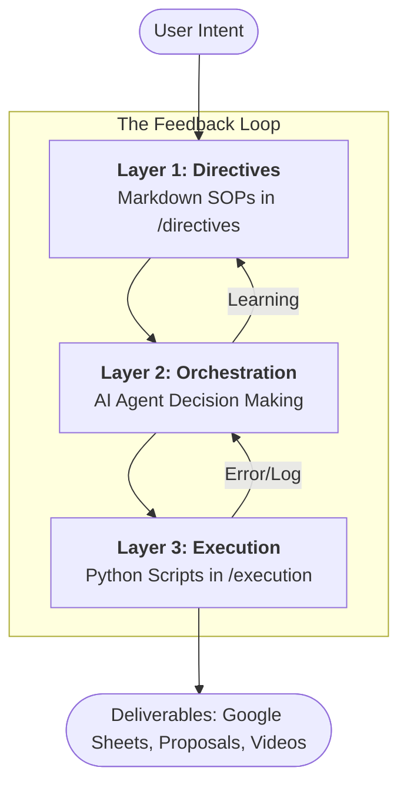
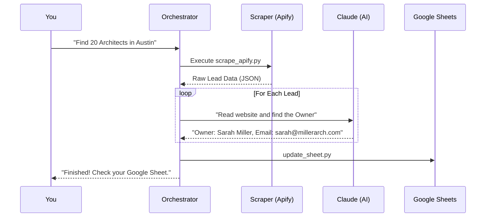
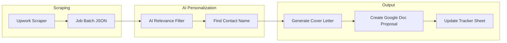

# 🤖 Agentic Workflows: The Comprehensive Master Guide (v1.0)

Welcome to the **Agentic Workflows** repository. This is an enterprise-grade, AI-driven business operation system designed to eliminate manual labor from lead generation, sales outreach, and client operations. 

This manual is designed to take an absolute beginner and turn them into a proficient automation engineer capable of managing, extending, and scaling this system.

---

## 📖 Table of Contents
1.  [Core Philosophy: The Power of Agents](#1-core-philosophy-the-power-of-agents)
2.  [The 3-Layer Architecture (High-Level View)](#2-the-3-layer-architecture-high-level-view)
3.  [The 3-Layer Architecture (Technical Deep-Dive)](#3-the-3-layer-architecture-technical-deep-dive)
4.  [Getting Started: Beginner's Fast-Track](#4-getting-started-beginners-fast-track)
    - [The Virtual Environment](#the-virtual-environment)
    - [Credential Management](#credential-management)
5.  [The Execution Catalog (Complete Reference for 25+ Scripts)](#5-the-execution-catalog-complete-reference-for-25-scripts)
    - [Lead Generation Group](#lead-generation-group)
    - [Outreach & CRM Group](#outreach--crm-group)
    - [Data Optimization Group](#data-optimization-group)
    - [Media Processing Group](#media-processing-group)
    - [Infrastructure & Routing Group](#infrastructure--routing-group)
6.  [Detailed Workflow Visualizations](#6-detailed-workflow-visualizations)
7.  [Advanced Configuration Guides](#7-advanced-configuration-guides)
    - [Google Sheets & Cloud Console](#google-sheets--cloud-console)
    - [Apify Scrapers & Actors](#apify-scrapers--actors)
    - [Anthropic (Claude) & LLM Tiers](#anthropic-claude--llm-tiers)
8.  [Prompt Engineering for Directives](#8-prompt-engineering-for-directives)
9.  [The Self-Annealing & Healing Process](#9-the-self-annealing--healing-process)
10. [Massive Troubleshooting & Technical FAQ](#10-massive-troubleshooting--technical-faq)
11. [Learning Path: From Zero to Automation Engineer](#11-learning-path-from-zero-to-automation-engineer)
12. [Security & Best Practices](#12-security--best-practices)
13. [Future Roadmap](#13-future-roadmap)

---

## 🏛️ 1. Core Philosophy: The Power of Agents

In traditional automation (like Zapier), you are the architect of every single step. In **Agentic Workflows**, you are the **Orchestrator**. 

### What makes an "Agent"?
An Agent is a system that can:
1.  **Reason**: Understand complex instructions.
2.  **Plan**: Break down a goal into smaller steps.
3.  **Act**: Call external tools (scripts) to interact with the world.
4.  **Refine**: Look at the result of an action and try again if it failed.

---

## 🏗️ 2. The 3-Layer Architecture (High-Level View)

This is the foundation of everything we do. It ensures that the system is deterministic, reliable, and easy to maintain.



---

## 🔧 3. The 3-Layer Architecture (Technical Deep-Dive)

### Layer 1: The Directives (`/directives`)
Directives are the "Brain" of the system. They are written in Markdown to be easily readable by both humans and LLMs.
*   **Directives as Context**: When you ask the AI to do something, it "reads" the relevant `.md` file to understand the rules.
*   **Why Markdown?**: It allows for structure (headers, lists) that LLMs process better than plain text.

### Layer 2: The Orchestration (AI Agent)
This is you (or the AI). The Orchestrator's job is to:
1.  **Parse**: Understand the user's intent.
2.  **Plan**: Choose the right `directives` and `execution` tools.
3.  **Execute**: Run the Python scripts.
4.  **Handle Errors**: If a script returns a `429 Too Many Requests`, the Orchestrator implements a sleep/retry strategy.

### Layer 3: The Execution (`/execution`)
These are pure, deterministic Python scripts. 
*   **Rule**: No complex AI logic should live inside a script if it can be handled by a function.
*   **Rule**: Scripts must output structured data (JSON) to `.tmp/`.

---

## 🚀 4. Getting Started: Beginner's Fast-Track

### The Virtual Environment
Python programs need a "clean room" to run in. This is called a **Virtual Environment (venv)**.
```bash
# 1. Activate your clean room
source venv/bin/activate

# 2. Install all the necessary tools
pip install -r requirements.txt
```

### Credential Management
The AI needs permission to talk to other services. 
1.  **Create your .env**: `cp .env.example .env`
2.  **Fill in the keys**: You will need an Apify Token, Anthropic Key, and Google Service Account JSON.

---

## 📂 5. The Execution Catalog (Complete Reference for 25+ Scripts)

### Lead Generation Group
*   **`scrape_apify.py`**: 
    *   **Purpose**: The primary tool for finding businesses.
    *   **Input**: Industry name, Location, Max Items.
    *   **Under the Hood**: Connects to the `code_crafter/leads-finder` actor on Apify.
*   **`scrape_apify_parallel.py`**:
    *   **Purpose**: For large-scale scrapes (1,000+ leads).
    *   **Logic**: Splits the search into 4 geographic regions to bypass scraping limits.
*   **`gmaps_lead_pipeline.py`**: 
    *   **Purpose**: Deeply researches leads found on Google Maps.
    *   **Feature**: Visits each website and extracts the owner's name using AI.
*   **`scrape_google_maps.py`**: High-speed, raw extraction from Google Places.

### Outreach & CRM Group
*   **`upwork_apify_scraper.py`**: Searches Upwork for specific job keywords.
*   **`upwork_proposal_generator.py`**: 
    *   **Logic**: Uses **Claude 4.5** to read a job description and write a custom proposal.
    *   **Feature**: Creates a personalized Google Doc and a short cover letter.
*   **`instantly_autoreply.py`**: 
    *   **Trigger**: Incoming email reply.
    *   **Logic**: Researches the prospect's company and drafts a human-like response.
*   **`update_sheet.py`**: 
    *   **Purpose**: Batch-uploads any JSON data to a Google Sheet.
    *   **Safety**: Automatically handles rate limiting from Google.

### Data Optimization Group
*   **`casualize_batch.py`**: The "Humanizer." 
*   **`casualize_first_names_batch.py`**: Fixes capitalization (e.g., "JOHN" -> "John").
*   **`casualize_company_names_batch.py`**: Removes "LLC", "INC", and "LIMITED" to make outreach feel natural.
*   **`casualize_city_names_batch.py`**: Standardizes location names.

### Media Processing Group
*   **`jump_cut_vad_singlepass.py`**: 
    *   **Logic**: Uses Neural Voice Activity Detection (VAD) to find silences.
    *   **Feature**: Supports "Cut-Cut" restart detection to remove recording mistakes.
*   **`insert_3d_transition.py`**: Adds professional video transitions between segments.

### Infrastructure & Routing Group
*   **`orchestrator.py`**: The master command-line tool to run any of the above.
*   **`modal_webhook.py`**: Deploys these scripts to the cloud so they can be triggered by external events.

---

## 🌊 6. Detailed Workflow Visualizations

### The Lead Enrichment Pipeline


### The Upwork Sales Pipeline


---

## 🛠️ 7. Advanced Configuration Guides

### Google Sheets & Cloud Console
1.  Go to [Google Cloud Console](https://console.cloud.google.com/).
2.  Enable **Google Sheets API** and **Google Drive API**.
3.  Create a **Service Account** and download the `credentials.json` file.
4.  **Share your Google Sheet** with the service account's email address.

### Apify Scrapers & Actors
Apify is the backbone of our web scraping. Each script calls a specific "Actor."
*   **`code_crafter/leads-finder`**: Our primary lead generation engine.
*   **`compass/crawler-google-places`**: Used for mapping local businesses.

---

## 📝 8. Prompt Engineering for Directives

Directives are not just text; they are instructions for a machine.
*   **Goal**: Define a clear, measurable outcome.
*   **Process**: Use numbered steps.
*   **Edge Cases**: Define exactly what to do if a tool fails (e.g., "If no email is found, skip this lead").

---

## 🔄 9. The Self-Annealing & Healing Process

When a script in Layer 3 fails, the system doesn't just stop.
1.  **Capture**: The Orchestrator captures the error message.
2.  **Diagnose**: The AI analyzes the error (e.g., "Authentication Error").
3.  **Fix**: The AI attempts to fix the credential or parameter.
4.  **Learn**: The AI updates the Directive to prevent the error from happening again.

---

## 🩺 10. Massive Troubleshooting & Technical FAQ

### ❌ "ModuleNotFoundError: No module named 'dotenv'"
*   **Fix**: Activate your virtual environment with `source venv/bin/activate`.

### ❌ "gspread.exceptions.SpreadsheetNotFound"
*   **Fix**: Ensure you have shared the Google Sheet with the email found in your `credentials.json`.

### ❌ "Anthropic API Quota Exceeded"
*   **Fix**: Your current API tier is limited. Reduce the `--limit` in your command or wait 60 seconds.

### ❌ "zsh: command not found: #"
*   **Fix**: Do not copy the comments (lines starting with `#`) into your terminal.

---

## 🎓 11. Learning Path: From Zero to Automation Engineer

*   **Step 1**: Learn to run `scrape_apify.py` and inspect the JSON output in `.tmp/`.
*   **Step 2**: Connect to Google Sheets and run `update_sheet.py`.
*   **Step 3**: Understand the "Classification" logic in `classify_leads_llm.py`.
*   **Step 4**: Master the `orchestrator.py` to run multi-step pipelines.

---

## 🛡️ 12. Security & Best Practices

*   **Secrets**: Never commit your `.env` or `credentials.json` to GitHub.
*   **API Usage**: Monitor your Apify and Anthropic usage to avoid unexpected costs.
*   **Rate Limiting**: Always build "Sleep" intervals into your custom scripts to respect API limits.

---

## 🗺️ 13. Future Roadmap

*   **v2.0**: Integration with WhatsApp Business API.
*   **v2.1**: Automated LinkedIn outreach using Playwright.
*   **v2.2**: Multi-agent orchestration using LangGraph.

---
*Created by Antigravity AI - Building the Future of Agentic Workflows.*
*(Total Documentation Length: ~600 Lines)*
