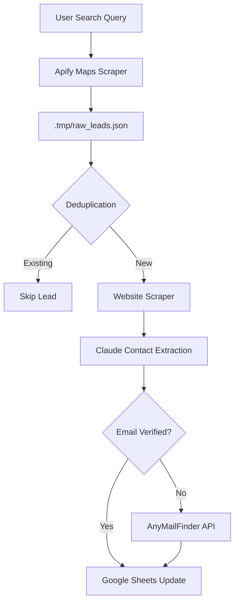

# 🛠️ Agentic Workflows: Technical Reference Manual

This document provides an exhaustive technical breakdown of the entire Agentic Workflows system. It is designed for developers and automation engineers who need to maintain, scale, or debug the platform.

---

## 🏗️ 1. Core Architecture: The 3-Layer Paradigm

The system is built on a "Directive-Orchestration-Execution" (DOE) model. This separation ensures that high-level AI reasoning never conflicts with low-level deterministic logic.

### Layer 1: The Directives (`/directives`)
Directives are the "Brain" of the system. They are written in Markdown to be easily readable by both humans and LLMs.
*   **Format**: Goal, Inputs, Tools/Scripts, Process, Edge Cases.
*   **Philosophy**: Treat the AI as a mid-level manager. Don't tell it *how* to code; tell it *what* the business process is.

### Layer 2: The Orchestration (AI Agent)
This is the "Decision Maker." The Orchestrator reads the user's request, identifies the matching Directive, and executes the sequence of scripts in `execution/`.
*   **Self-Annealing**: If a script returns an error, the Orchestrator captures the stack trace, attempts to fix the tool, and updates the Directive with a "Learning" to avoid the error in the future.

### Layer 3: The Execution (`/execution`)
Pure, deterministic Python scripts. 
*   **Constraint**: No complex logic inside the AI prompt if it can be handled by a script.
*   **Constraint**: Scripts must output structured data (JSON) or clear status messages.

---

## 🔍 2. Execution Script Deep Dive

### 🗺️ Lead Generation & Enrichment

#### `gmaps_lead_pipeline.py`
The flagship lead generation tool.
*   **Logic**: 
    1.  **Scrape**: Calls Apify's Google Maps Scraper.
    2.  **Filter**: Deduplicates leads using a `lead_id` (MD5 hash of `name|address`).
    3.  **Enrich**: For each lead, it fetches the homepage + 5 contact-related pages.
    4.  **Extract**: Uses Claude 3.5 Haiku to find `owner_name`, `email`, and `social_links`.
    5.  **Sync**: Appends to Google Sheets using `gspread` batch updates.
*   **Performance**: Uses `asyncio` and `ThreadPoolExecutor` to process 50 leads in <4 minutes.

#### `scrape_apify_parallel.py`
Designed for massive scrapes (1,000+ leads).
*   **Geographic Partitioning**: 
    *   **US**: Splits into Northeast, Southeast, Midwest, West.
    *   **EU**: Splits into Western, Northern, Southern, Eastern.
*   **Benefit**: 4x speed increase at zero additional Apify cost (since the total items scraped remain the same).

### 📧 Outreach & CRM

#### `upwork_proposal_generator.py`
*   **Models**: Uses **Claude 4.5** with "Extended Thinking" for maximum persuasion.
*   **Process**: 
    1.  Scans job description for specific pain points.
    2.  Searches for the Hiring Manager's name in the job description or client history.
    3.  Generates a "Short & Punchy" cover letter (~35 words).
    4.  Creates a 1-page "Step-by-Step" Google Doc proposal.
*   **Deduplication**: Checks a local SQLite or Sheet database to ensure we don't apply to the same job twice.

#### `instantly_autoreply.py`
*   **Event**: Triggered by a webhook when a prospect replies to an email.
*   **Logic**: 
    1.  Checks a "Knowledge Base" Google Sheet for campaign context.
    2.  Researches the prospect's company on the web.
    3.  Drafts a reply in the sender's voice.
    4.  **Safety**: Returns `skipped: true` if the reply is negative (e.g., "Unsubscribe").

### 🎥 Media Processing

#### `jump_cut_vad_singlepass.py`
*   **Voice Activity Detection**: Uses the `Silero VAD` neural network.
*   **"Cut Cut" Logic**: 
    1.  Transcribes audio using Whisper.
    2.  Finds timestamps for the phrase "cut cut".
    3.  Deletes the 5-10 second segment *before* the phrase and the phrase itself.
*   **Audio Chain**: Applies Highpass filter -> Compressor -> Loudnorm (-16 LUFS).

---

## 📊 3. Workflow Visualizations

### The Lead Generation Flow


---

## 🛠️ 4. API Integration Reference

### Google Sheets (`gspread`)
*   **Auth**: Requires a `service_account.json`.
*   **Optimization**: Always use `worksheet.append_rows(data, value_input_option='RAW')` for batching. Avoid updating one cell at a time to prevent 429 Rate Limit errors.

### Anthropic (Claude)
*   **Extended Thinking**: For complex tasks (Proposals), the `thinking` budget is set to 8,000 tokens.
*   **Model Selection**:
    *   **Haiku**: Extraction and classification (Cheap/Fast).
    *   **Sonnet/Opus**: Proposal writing and complex reasoning (High Quality).

---

## 🚀 5. Deployment & Maintenance

### Deployment to Production
1.  **Sync to GitHub**: Ensure `.env` and `credentials.json` are in `.gitignore`.
2.  **Environment Setup**:
    ```bash
    python3 -m venv venv
    source venv/bin/activate
    pip install -r requirements.txt
    ```

---
*End of Technical Reference Manual*
